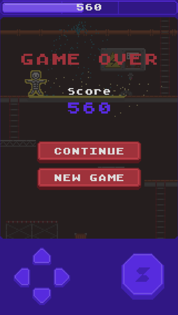
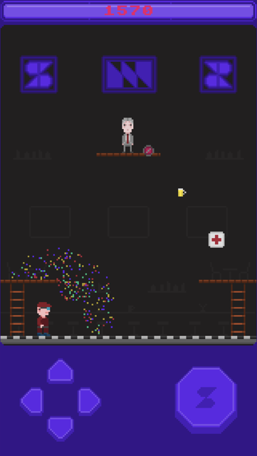

# Ladderszat

A game built for a Dutch rapper as promotional game tied to an album release. Developed with the Phaser 3 library in
TypeScript. Focus is on modular scenes, data-driven levels, and responsive input (keyboard + touch) playable in the
browser on Desktop, iOS and Android.

[Play here](https://ladderszat.wdudokvanheel.nl/)

## Screenshots

|                          |                                |                                 |                        |
|--------------------------|--------------------------------|---------------------------------|------------------------|
|  |  |  |  |

### Controls

* **Move**: Arrow keys / WASD / IJKL / on-screen D-pad
* **Jump**: Space / Enter / E / O / on-screen jump button

---

## Technical Overview

* **Engine**: Phaser 3, Arcade physics
* **Language**: TypeScript
* **Bundler**: Webpack
* **Asset formats**:
    * Sprites & tiles: PNG, spritesheets
    * Level data & constants: YAML / JSON
    * Audio: WAV, MP3, M4A

---

## General project structure & features

* **Scenes**

    * `InitScene`: preload assets, start gameplay & UI
    * `GameplayScene`: core loop, level loading, physics, input, logic dispatch
    * `UIOverlayScene`: on-screen D-pad, jump button, progress bar, score, debug text
    * `GameOverScene` / `LevelCompleteScene` / `EnterNameScene` / `HighscoreScene`: end-of-level flow, name entry,
      high-score handling

* **Input**

    * Keyboard (arrows/WASD/IJKL/etc.) + touch (D-pad + jump button)
    * Abstracted via `JumpInputModel` & `UIOverlayScene`
    * Optional ignore-keyboard mode for modal input

* **Levels**

    * Three levels, each with its own `LevelLogic` subclass
    * Data-driven via `LevelDataLoader` reading `level-*.json`
    * Runtime generation of platforms, ladders, collectibles, exit

* **Controllers & Systems**

    * `PhysicsController`: velocity, jump/coyote time, climbing
    * `CollisionController`: platform, ladder, bucket, collectible collisions
    * `GraphicsController`: animation state, sprite facing
    * `SoundController`: event-driven SFX & music
    * `DebugController`: on-screen logging of internal state

* **Game Context**

    * `GameContext` plugin holds shared state (player, groups, level data, score, progress, drunk effect)
    * Reset / restart logic for levels and full game

* **Data & Constants**

    * `constants.yml`: screen/world dimensions, player physics, control deadzones, asset paths
    * Color palettes, bucket speeds, timing values, drink & bucket variants

* **Highscore & Persistence**

    * Online submission to a score server, fallback to localStorage
    * Displays top 10; if outside top 10, shows nearest ranks

## Random Notes

* Ladder rendering is generated at runtime to match segment count
* “Drunk” mechanic alters physics damping & adds shake/noise
* Progress bar reflects level progression from collectible count
* Debug overlay (toggle via `DEBUG_CONTROLLER`) prints internal values

---

## Directory Structure

```
src/
├── assets/
│   ├── audio/       # SFX & music
│   ├── data/        # constants.yml, level-*.json
│   └── images/      # spritesheets & PNGs
├── controller/      # Physics, Collision, Graphics, Sound, Debug
├── factory/         # ObjectFactory, PlatformFactory, LadderFactory
├── loader/          # ImageLoader, LevelDataLoader
├── logic/           # Level1, Level2, Level3 logic
├── model/           # GameContext, JumpInputModel, Highscore types
├── scenes/          # All Phaser scenes (UIOverlay, Gameplay, etc.)
├── main.ts          # bootstrap & HMR support
└── GameConfig.ts    # Phaser game configuration
```

---

